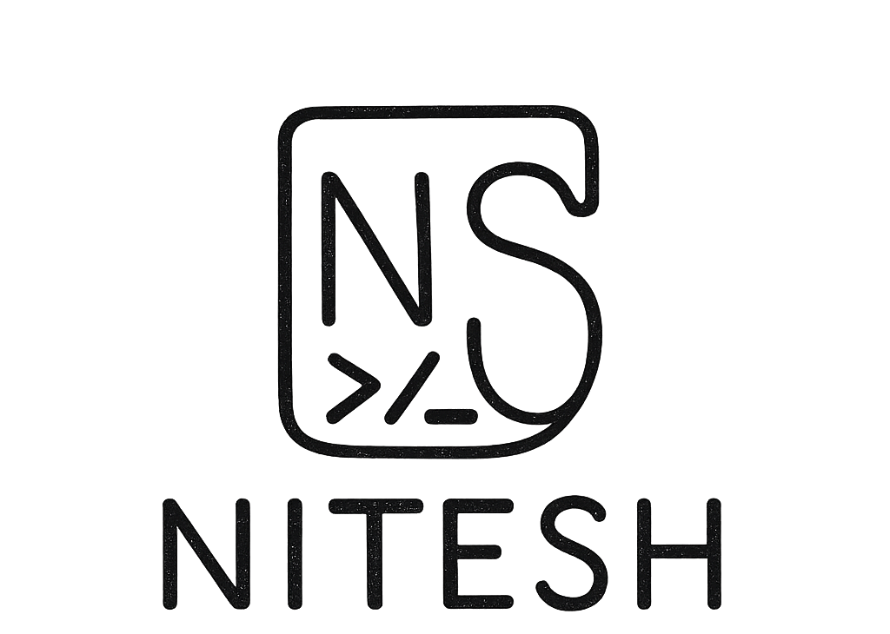

<div align="center">
<a href="https://niteshsolanki.com"></a>
</div>

<div align="center">
<h1>niteshsolanki.com</h1>
<p>My personal portfolio website</p>
</div>

# Tech Stack

- [NextJS][nextjs] - UI framework
- [Vercel][vercel] - Hosting and Deployment
- [Sanity.io][sanity]: Headless CMS and Content Lake
- [TailwindCSS][tailwind] / CSS - Styling and UI
- [Umami][umami]: Analytics
- [Next Themes][nexttheme]: Color Theme
- [React Refractor][reactrefractor]: Syntax Highlighting

## Project Overview

| [Site][site]          | [Studio][studio]                 |
| --------------------- | -------------------------------- |
| ![Site][site-preview] | ![Sanity Studio][studio-preview] |

## Run Project Locally

### Clone Repository

```bash
git clone https://github.com/solanki-nitesh/improved-port.git

cd improved-port

npm install
```

- Rename `.env.example` to `.env.local`

### Get Environment Variables

The minimal `env` variables required to boot this project locally includes:

- `NEXT_PUBLIC_SANITY_PROJECT_ID` - Your Sanity project ID
- `NEXT_PUBLIC_SANITY_DATASET` - Your Sanity dataset (usually `production`)
- `NEXT_PUBLIC_SANITY_API_VERSION` - API version in YYYY-MM-DD format
- `NEXT_PUBLIC_SANITY_ACCESS_TOKEN` - Your Sanity access token (optional)

To get these variables, set up your own Sanity instance:

1. Create a new Sanity project:
```bash
npm create sanity@latest -- --template clean --create-project "Your Project Name" --dataset production
```

2. Copy your `projectId` from `sanity.config.ts`

3. Update `.env.local` with your Sanity credentials

4. Run the development server:
```bash
npm run dev
```

Visit [http://localhost:3000][localhost] to see the project live.

To add content, visit [http://localhost:3000/studio][localhost-studio] to access Sanity Studio.

## Build

```bash
npm run build
```

### Important Files and Folders

| File(s)                                        | Description                                     |
| ---------------------------------------------- | ----------------------------------------------- |
| `sanity.config.ts`                             | Config file for Sanity Studio                   |
| `lib/sanity.client.ts`                         | Config file for Sanity CLI                      |
| `app/studio/[[...index]]/page.tsx`             | Where Sanity Studio is mounted                  |
| `schemas`                                      | Where Sanity Studio gets its content types from |
| `lib/sanity.query.ts`                          | Groq query for Sanity Schema data               |

## License

This project is licensed under the MIT License - see the [LICENSE](LICENSE) file for details.

## Author

**Nitesh Solanki**

- Website: [niteshsolanki.com][site]
- GitHub: [@solanki-nitesh][github]

<!-- Link Refs -->

[nextjs]: https://nextjs.org
[vercel]: https://vercel.com
[sanity]: https://sanity.io
[tailwind]: https://tailwindcss.com
[umami]: https://umami.is
[nexttheme]: https://github.com/pacocoursey/next-themes
[reactrefractor]: https://github.com/rexxars/react-refractor
[site]: https://niteshsolanki.com
[studio]: https://niteshsolanki.com/studio
[studio-preview]: https://github.com/solanki-nitesh/improved-port/assets/studio-preview.png
[site-preview]: https://github.com/solanki-nitesh/improved-port/assets/site-preview.png
[localhost]: http://localhost:3000
[localhost-studio]: http://localhost:3000/studio
[github]: https://github.com/solanki-nitesh
